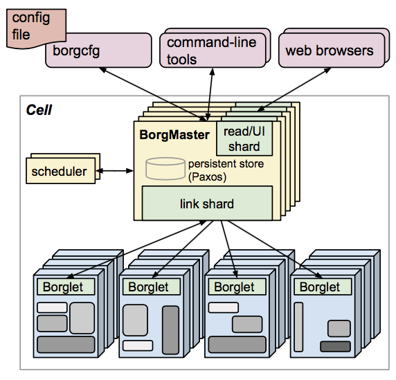
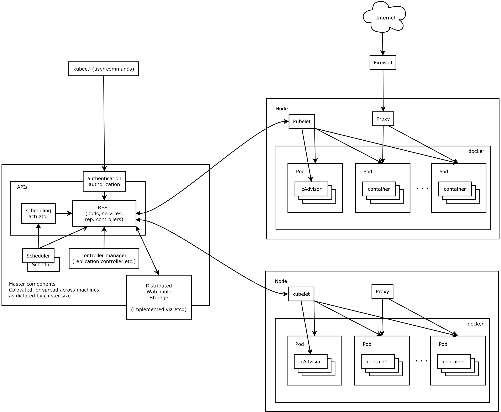
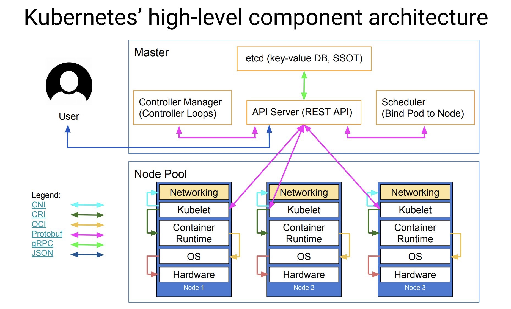

# 云原生入门简介

本文仅代表我个人理解，不代表为100%正确言论。文中不会再次重申此观点。有问题请批评指正。

## 什么是云原生

云原生计算基金会（CNCF）起初给出的定义：

· 应用容器化

· 面向微服务

· 应用支持容器的编排调度

重定义：（待补充）

云原生主要是一种文化和理念，并不是特指某种技术。而现在实现云原生这个理念的主流技术就是K8S。

## Kubernetes

### 为什么Kubernetes叫K8S？

​	因为K与s中间有8个字母。

### Kubernetes是什么？

​	他是一个容器编排系统，用于实现对容器调度。

### Kubernetes一家独大吗？

​	差不多，但也不是。Kubernetes是Google基于自家的Borg系统用go语言改写的。

​	但同时这个是开源项目，大家可以根据自己的需求进行改写。

​	这样就产生了很多种类似的系统，一般会称为“平台”。

​	比如有用于嵌入式系统的K3S、有红帽开发的Openshift、有Vmware的K8S、有爱立信的CCD。

​	所以并不是单纯的一家独大，但是大家都基于K8S。基础知识点是一致的。

还有什么其他问题吗？可以comment提问。

之前有说过K8S是对**容器**的调度，容器是什么？

这就不得不提到Docker。

## Docker

Docker可以被认为是覆盖了整个容器界，可能听说过containerd，这个也是Docker分出去的一个模块而已。还有cri-o，这个我目前没了解过。

具体的Docker学习在此暂不过多介绍。

好了回到K8S。K8S被称为一个系统，是需要既有软件又有硬件的知识的。

## K8S包含的资源

一个计算机主要关注两个资源：计算资源、存储资源

一群计算机主要关注三个资源：计算资源、存储资源、网络资源

K8S作为集群的管理所以也是需要关注三个资源。

### 工作资源

工作资源类似计算资源，为整个集群提供计算服务。

从硬件的角度：工作资源为Node。一个Node一般是一台完整的物理机。

从软件的角度：工作资源的调度单位为Pod。一个Pod类似是一个Node上的虚拟机，所以一个Node上可以有多个Pod。

​	这时候可能就有人要问了，容器呢？

​	容器在Pod里运行，一个Pod内可以运行一个或多个容器实例。（一般一个Pod只运行一个容器）*存疑*，一个Pod一般只完成一个服务（功能）。

### 存储资源

从硬件的角度：为各个物理机上的硬盘。

从软件的角度：持久性存储资源需要K8S进行分配，保存在host机上。

### 网络资源

从硬件的角度：为物理机上的网卡。

从软件的角度：K8S内部给个功能模块需要进行通信，各个Pod之间需要使用网络进行通信。

## K8S架构

提到K8S架构，首先可以简单看看他的祖先Borg的架构。简单过一下就可以，详细的不做讲解。

之后看看K8S官网的架构图：

再展示一些网上的第三方绘图：

首先先简单介绍一下这些内容，图中所示内容在官方文档被称为“组件”，还有一些为“插件”。插件一看就不是必备的，暂时先不提。先来看看组件。

组件分**控制平面组件**以及**Node组件**（我不是很懂这个分法）：

### 控制平面组件

这部分官方文档讲的很好，我摘了一些过来。

**kube-apiserver**

API 服务器是 Kubernetes 控制平面的组件， 该组件负责公开了 Kubernetes API，负责处理接受请求的工作。 API 服务器是 Kubernetes 控制平面的前端。

**etcd**

etcd 是兼顾一致性与高可用性的键值数据库，可以作为保存 Kubernetes 所有集群数据的后台数据库。

**kube-scheduler**

kube-scheduler 是控制平面的组件， 负责监视新创建的、未指定运行节点（node）的 Pods， 并选择节点来让 Pod 在上面运行。

**kube-controller-manager**

kube-controller-manager 是控制平面的组件， 负责运行控制器进程。

从逻辑上讲， 每个控制器都是一个单独的进程， 但是为了降低复杂性，它们都被编译到同一个可执行文件，并在同一个进程中运行。

这些控制器包括：

节点控制器（Node Controller）：负责在节点出现故障时进行通知和响应

任务控制器（Job Controller）：监测代表一次性任务的 Job 对象，然后创建 Pods 来运行这些任务直至完成

端点控制器（Endpoints Controller）：填充端点（Endpoints）对象（即加入 Service 与 Pod）

服务帐户和令牌控制器（Service Account & Token Controllers）：为新的命名空间创建默认帐户和 API 访问令牌

**cloud-controller-manager**

一个 Kubernetes 控制平面组件， 嵌入了特定于云平台的控制逻辑。 云控制器管理器（Cloud Controller Manager）允许你将你的集群连接到云提供商的 API 之上， 并将与该云平台交互的组件同与你的集群交互的组件分离开来。

cloud-controller-manager 仅运行特定于云平台的控制器。 因此如果你在自己的环境中运行 Kubernetes，或者在本地计算机中运行学习环境， 所部署的集群不需要有云控制器管理器。

节点组件会在每个节点上运行，负责维护运行的 Pod 并提供 Kubernetes 运行环境。

### Node组件

**kubelet**

kubelet 会在集群中每个节点（node）上运行。 它保证容器（containers）都运行在 Pod 中。

kubelet 接收一组通过各类机制提供给它的 PodSpecs， 确保这些 PodSpecs 中描述的容器处于运行状态且健康。 kubelet 不会管理不是由 Kubernetes 创建的容器。

**kube-proxy**

kube-proxy 是集群中每个节点（node）所上运行的网络代理， 实现 Kubernetes 服务（Service） 概念的一部分。

**容器运行时（Container Runtime）**

容器运行环境是负责运行容器的软件。

Kubernetes 支持许多容器运行环境，例如 containerd、 CRI-O 以及 Kubernetes CRI (容器运行环境接口) 的其他任何实现。

这些我理解可以认为是计算资源上以及存储资源上的架构，接下来看一张接口上的架构：

